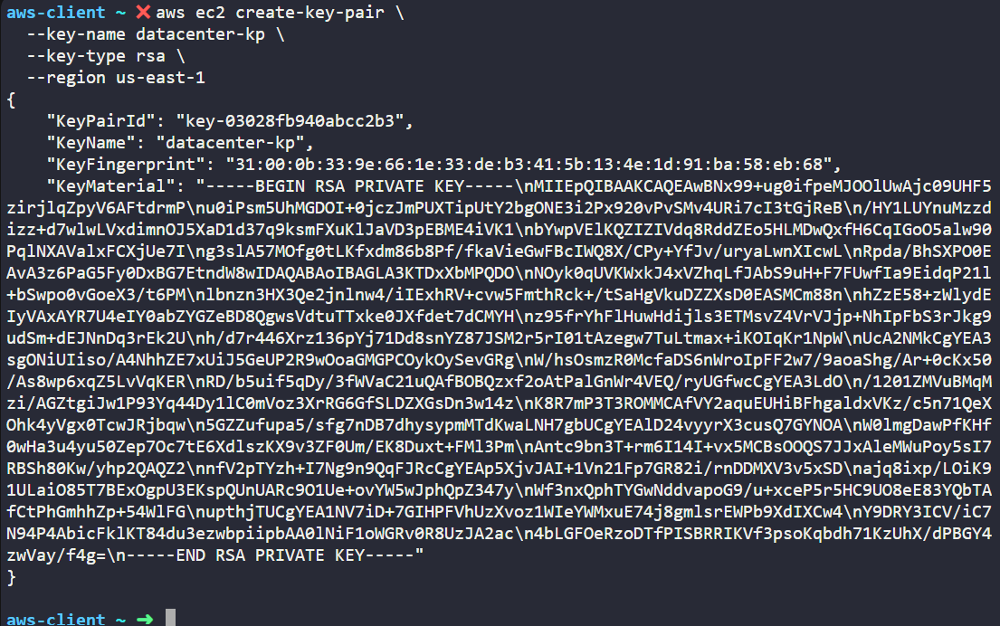
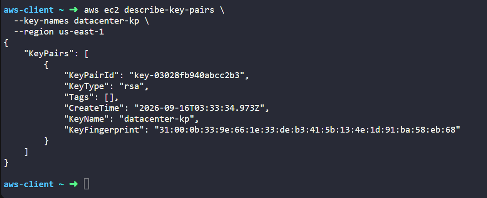

# Day 01 — Create an AWS EC2 Key Pair

## Task

The Nautilus DevOps team is strategizing the migration of a portion of their infrastructure to the AWS cloud. Recognizing the scale of this undertaking, they have opted to approach the migration in incremental steps rather than as a single massive transition. To achieve this, they have segmented large tasks into smaller, more manageable units. This granular approach enables the team to execute the migration in gradual phases, ensuring smoother implementation and minimizing disruption to ongoing operations. By breaking down the migration into smaller tasks, the Nautilus DevOps team can systematically progress through each stage, allowing for better control, risk mitigation, and optimization of resources throughout the migration process.

For this task, create a key pair with the following requirements:

1. Name of the `key pair` should be `datacenter-kp`.

2. Key pair `type` must be `rsa`.

### Notes

* Create the resources only in the `us-east-1` region.
* The AWS client machine can be used to run AWS CLI commands.

---

## Requirements

| Requirement   | Value           |
| ------------- | --------------- |
| Key Pair Name | `datacenter-kp` |
| Key Pair Type | `RSA`           |
| AWS Region    | `us-east-1`     |

---

## What is an AWS EC2 Key Pair?

An EC2 key pair is used for authentication when connecting to an EC2 instance.

A key pair consists of:

```text
Public Key
Private Key
```

The **public key** is associated with the EC2 instance, while the **private key** is kept by the user.

For SSH access, the private key is used to prove that the user has the corresponding credential.

The private key must be kept secure and should never be committed to GitHub.

---

## What is an AWS Region?

An AWS Region is a geographical area where AWS operates its cloud infrastructure.

Examples:

```text
us-east-1       → US East (N. Virginia)
us-west-2       → US West (Oregon)
eu-west-1       → Europe (Ireland)
ap-south-1      → Asia Pacific (Mumbai)
ap-southeast-1  → Asia Pacific (Singapore)
```

AWS Regions contain multiple **Availability Zones**, which contain AWS data center infrastructure.

For this task, the required region is:

```text
us-east-1
```

The region matters because many AWS resources are created within a specific region. Creating the resource in another region would not satisfy this task.

---

# Solution

## Step 1 — Open the AWS Client Terminal

Use the terminal provided by KodeKloud on the `aws-client` machine.

First, the temporary lab credentials can be checked with:

```bash
showcreds
```

The credentials are provided only for the lab environment and should not be saved in the GitHub repository.

---

## Step 2 — Create the Key Pair

Run the following command:

```bash
aws ec2 create-key-pair \
  --key-name datacenter-kp \
  --key-type rsa \
  --region us-east-1
```


The same command can also be written on one line:

```bash
aws ec2 create-key-pair --key-name datacenter-kp --key-type rsa --region us-east-1
```

Both versions perform the same operation.

---

## Step 3 — Understand the Command

```bash
aws
```

Starts the AWS Command Line Interface.

```bash
ec2
```

Specifies that we are working with the Amazon EC2 service.

```bash
create-key-pair
```

Tells AWS to create a new EC2 key pair.

```bash
--key-name datacenter-kp
```

Sets the key pair name to:

```text
datacenter-kp
```

```bash
--key-type rsa
```

Specifies RSA as the key type.

```bash
--region us-east-1
```

Specifies that the resource should be created in the `us-east-1` AWS Region.

---

## Step 4 — Verify the Key Pair

After creating the key pair, verify that it exists:

```bash
aws ec2 describe-key-pairs \
  --key-names datacenter-kp \
  --region us-east-1
```


A more specific command is:

```bash
aws ec2 describe-key-pairs \
  --key-names datacenter-kp \
  --region us-east-1 \
  --query 'KeyPairs[0].[KeyName,KeyType,KeyFingerprint]'
```

The output should contain:

```text
datacenter-kp
rsa
<fingerprint>
```

This confirms that the required key pair exists in the correct region.

---

# Understanding the `\` in the Command

The backslash `\` at the end of a line is used by the Bash shell to continue the command on the next line.

For example:

```bash
aws ec2 create-key-pair \
  --key-name datacenter-kp \
  --key-type rsa \
  --region us-east-1
```

is equivalent to:

```bash
aws ec2 create-key-pair --key-name datacenter-kp --key-type rsa --region us-east-1
```

The `\` is not an AWS option. It is simply being used to make a long command easier to read.

---

# Important Security Notes

### Protect private keys

Private keys should never be publicly exposed.

Do not:

```text
Commit them to GitHub
Upload them to public storage
Share them with others
Include them in screenshots
Paste them into public documentation
```

If a private key file is created locally, a common Linux permission is:

```bash
chmod 400 datacenter-kp.pem
```

A `.gitignore` can also be used to prevent accidental commits:

```gitignore
*.pem
*.key
```

### Never commit AWS credentials

Temporary KodeKloud credentials should also never be added to the repository.

---

# Why This Matters in DevOps

Key pairs are part of cloud infrastructure security and server authentication.

A simplified EC2 access flow looks like:

```text
Developer
    |
    | Private Key
    v
   SSH
    |
    v
EC2 Instance
    |
    | Public Key
    v
Authentication
```

In real-world AWS environments, teams may also use services such as AWS Systems Manager Session Manager to reduce the need for direct SSH access.

---

# Commands Used

### Create the key pair

```bash
aws ec2 create-key-pair \
  --key-name datacenter-kp \
  --key-type rsa \
  --region us-east-1
```

### Verify the key pair

```bash
aws ec2 describe-key-pairs \
  --key-names datacenter-kp \
  --region us-east-1
```

### Verify selected information

```bash
aws ec2 describe-key-pairs \
  --key-names datacenter-kp \
  --region us-east-1 \
  --query 'KeyPairs[0].[KeyName,KeyType,KeyFingerprint]'
```

---

# Final Result

The EC2 key pair was created with the required configuration:

```text
Key Pair Name : datacenter-kp
Key Type      : RSA
AWS Region    : us-east-1
```

## Task Status

```text
Completed
```

---

# Key Takeaways

* AWS CLI can be used to manage AWS resources from the terminal.
* EC2 key pairs are used for authentication.
* RSA is a public-key cryptographic algorithm.
* The private key must be kept secret.
* AWS resources can be region-specific.
* `us-east-1` is the required AWS Region for this task.
* `--region us-east-1` explicitly tells AWS where to create the resource.
* `\` allows a Bash command to continue across multiple lines.

---

## Skills Practiced

```text
AWS
├── AWS CLI
├── Amazon EC2
├── EC2 Key Pairs
├── RSA
├── Public-Key Cryptography
├── SSH Authentication
└── AWS Regions
```

**Day 01 completed.**
